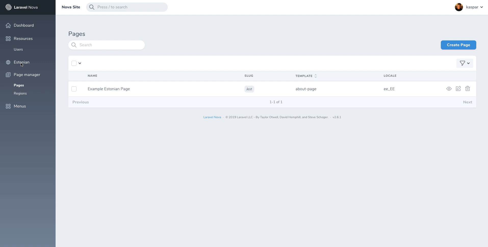

# Nova Lang

[Laravel Nova](https://nova.laravel.com) package that allows you to set localization of content.



## Installation

Install the package in a Laravel Nova project via Composer and run migrations:

```bash
# Install package
composer require optimistdigital/nova-lang
```

Publish the `nova-lang` configuration file and edit it to your preference:

```bash
php artisan vendor:publish --provider="OptimistDigital\NovaLang\ToolServiceProvider" --tag="config"
```

Register the tool with Nova in the `tools()` method of the `NovaServiceProvider`:

```php
// in app/Providers/NovaServiceProvider.php

public function tools()
{
    return [
        // ...
        new \OptimistDigital\NovaLang\NovaLang
    ];
}
```

## Defining locales

```php
// in /config/nova-lang.php

// ...
'locales' => [
  'en' => 'English',
   'et' => 'Estonian',
],
```

After defining locales in /config/nova-lang.php, you can use helper function.

```php
$locales = nova_lang_get_all_locales();

//or you can use it in another package.

'locales' => nova_lang_get_all_locales(),
```

## Usage

### Creating the field

```php
$fields[] = NovaLangField::make('Locale', 'locale');
```

If you are using a translation package like nova-locale-field, you can also give
locale_parent_id. localeParentId has to be optainable through url query. Make sure you have defined locale_parent_id in your database.

```php
$fields[] = LocaleFieldForm::make('Locale, 'locale', 'locale_parent_id')
```

### Sort resources by locale

```php
//Your resource file, where you have returned $fields array
public static function indexQuery(NovaRequest $request, $query)
{
    $query->where('your_table_name.locale', nova_lang_get_active_locale());
    return $query;
}
```

## Credits

- [Kaspar Rosin](https://github.com/KasparRosin)

## License

Nova page manager is open-sourced software licensed under the [MIT license](LICENSE.md).
